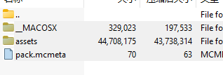
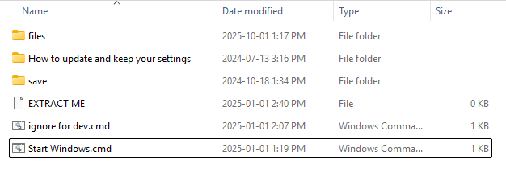
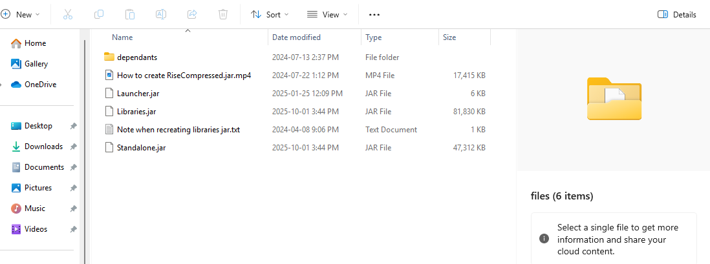
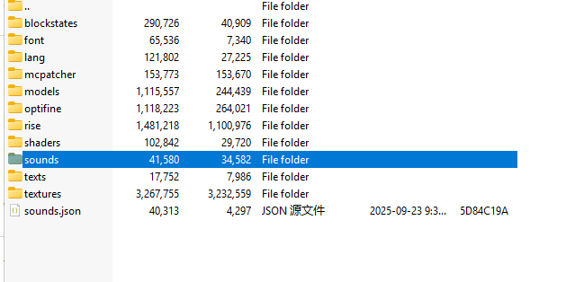

## Method 1: Check Game Settings

#### 1. Open Minecraft.
#### 2. Go to “Settings” > “Audio.”
#### 3. Ensure all volume sliders (e.g., Master Volume, Music, Ambient Sounds) are not muted.

## Method 2: Download and Install a Sound Pack

#### 1. Download the Sound Pack

Click one of the links below to get the sound pack:

- [Download from Discord](https://cdn.discordapp.com/attachments/1265664137652867210/1319283833966956594/Sound_Pack.zip?ex=69741591&is=6972c411&hm=e8f106183cf95c841a2ad8504074f4d4c25195cff4e1930cca7a915463c4f14d&)

#### 2. Install the Sound Pack

1. Open the Minecraft game directory.
2. Place the downloaded resource pack file (the `Sound Pack.zip` file) into the `resourcepacks` folder.
3. Launch the game and go to “Settings” > “Resource Packs.”
4. Select the newly added resource pack from the available list and enable it.
5. Save the settings and return to the game.

## Method 3: Manually Add Files into the JAR File

#### 1. Download the Sound Pack
Click one of the links below to get the sound pack:

- [Download from Discord](https://cdn.discordapp.com/attachments/1265664137652867210/1319283833966956594/Sound_Pack.zip?ex=69741591&is=6972c411&hm=e8f106183cf95c841a2ad8504074f4d4c25195cff4e1930cca7a915463c4f14d&)

#### 2. Open the Sound Pack
Use any zip software (e.g. **7-Zip** or **Bandizip**) to open the downloaded file.  
Inside, you will see the following files:  

#### 3. Locate Your Launcher Folder
- If you are using the **official Rise Launcher**, continue with steps 4–7.  
- If not, **skip to the note after step 7**.

#### 4. Open the Launcher Folder
Navigate to the folder where your launcher is installed (the one containing `start.bat` or `start_Macos.sh`):  

#### 5. Open the "files" Folder
Inside the launcher folder, find and open the **files** folder:  

#### 6. Open the JAR File
Open **Standalone.jar** as if it were a ZIP file (the same way you opened `Sound Pack.zip`).

#### 7. Merge the Assets Folder
- In the `Sound Pack.zip`, locate the folder named **assets**.  
- Drag and drop the **assets folder** into the `Standalone.jar`.  
- **Important:** Do **not** drag it inside any subfolder of `Standalone.jar`.  
- If prompted, choose **Merge** (not Replace).  

Your `Standalone.jar` should eventually look like this:  

#### Note for Non-Rise Launcher Users
If you are **not using the official Rise Launcher**, instead of steps 4 & 5 you need to find your `Rise.jar` in the Minecraft directory:

- **Minecraft Launcher (Windows):**  
  `%appdata%/.minecraft/versions/Rise/Rise.jar`

- **Minecraft Launcher (Mac):**  
  `~/Library/Application Support/Minecraft/versions/Rise/Rise.jar`